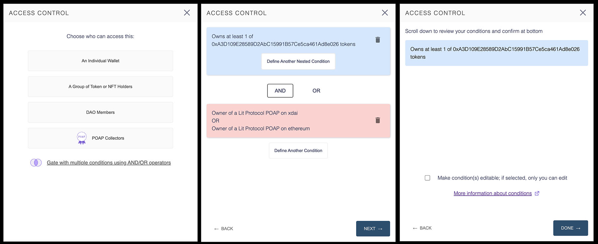

The Lit Share Modal is a tool for creating access control conditions for securing content with Lit Protocol.
[Click here to visit the Lit Protocol developer docs.](https://developer.litprotocol.com/docs/intro/)

- Secure content based on wallet address, token/NFT holdings, POAP ownership, or DAO membership.
- Create multiple paths for unlocking content by using AND/OR operators.
- Set your most used tokens/NFTs as defaults for quick and easy access.



A Vanilla JS wrapper for the Lit Share Modal is also available.
- [GitHub](https://github.com/LIT-Protocol/lit-share-modal-v2-vanilla-js)
- [NPM](https://www.npmjs.com/package/lit-share-modal-v2-vanilla-js)


# Installation

with npm

```
npm install --save lit-share-modal
```

with yarn

```
yarn add lit-share-modal
```

# Usage

with React Hooks

```
import ShareModal from 'lit-share-modal';
import { useState } from 'react';
import './App.css'

const App = () => {
  const [openShareModal, setOpenShareModal] = useState(false);

  const onAccessControlConditionsSelected = (shareModalOutput) => {
    // do things with share modal output
  }

  return (
    <div className={'App'}>
      <ShareModal onClose={() => setOpenShareModal(false)}
                  showModal={openShareModal}
                  onAccessControlConditionsSelected={onAccessControlConditionsSelected} />
    </div>

  );
}

export default App;

```

# Props

### Required

- `onClose` - callback for actions to take on closing the modal
- `showModal` - boolean that signals whether modal is open (true) or closed (false)
- `onAccessControlConditionsSelected` - callback for the share modal output

`onAccessControlConditions` provides an object with the following properties:

- `accessControlConditions` - an array of objects and nested arrays reflecting the selected conditions
- `permanent` - a boolean signaling whether conditions will be permanent (true) or editable by the author in the future (false)

Documentation on how these properties are used with the `LitJsSdk`, can be found in the [LitJsSdk docs](https://lit-protocol.github.io/lit-js-sdk/api_docs_html/index.html#litnodeclientsavesigningcondition)

### Optional

- `injectCSS` - a boolean that is set to true by default. When this is true, the CSS styles will be injected into the <head> of the page when the page loads, so there is no need to import any css. You can set this to "false" if you want to use your own CSS.
- `defaultTokens` - set quick access tokens that appear in the `Select a Token/NFT` menu

Three tokens/NFTs appear as default: `Ethereum`, `LitGate`, and `Blocks`

This list can be altered by passing an array of objects with the following properties:

- `label` - name of token/NFT
- `logo` - url of token/NFT favicon
- `value` - token/NFT address
- `symbol` - token/NFT symbol
- `standard` - token standard (ERC20, ERC721, or ERC1155)

**Example of a single entry quick access array**

```
export const defaultTokens = [
  {
    label: "Lit Genesis Gate",
    logo: "https://litgateway.com/favicon.png",
    value: "0xA3D109E28589D2AbC15991B57Ce5ca461Ad8e026",
    symbol: "LITGATE",
    standard: "ERC721",
  }
];
```
